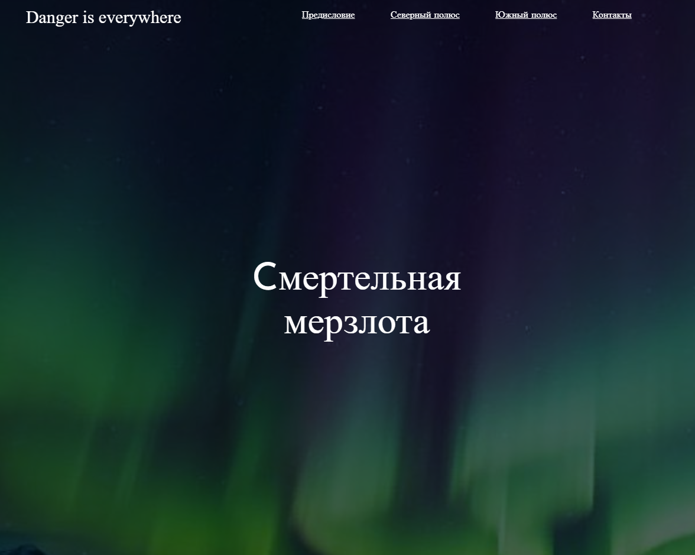
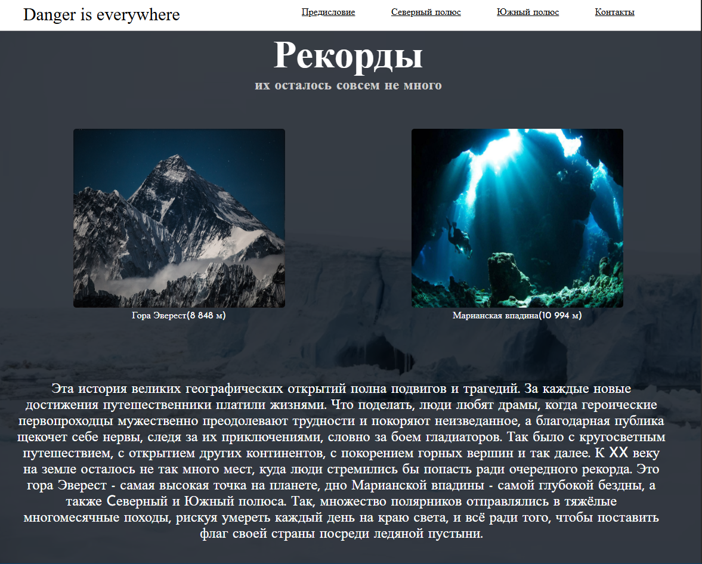
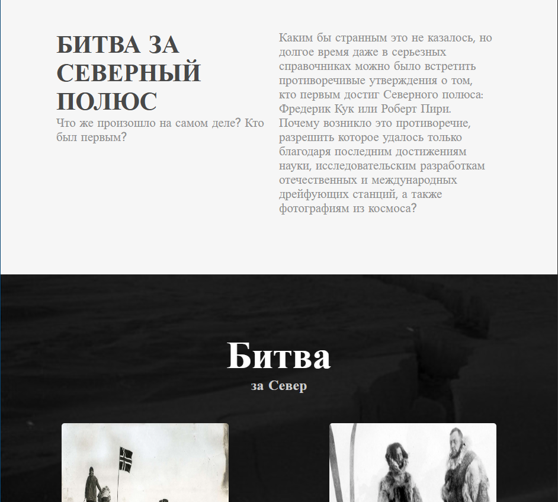
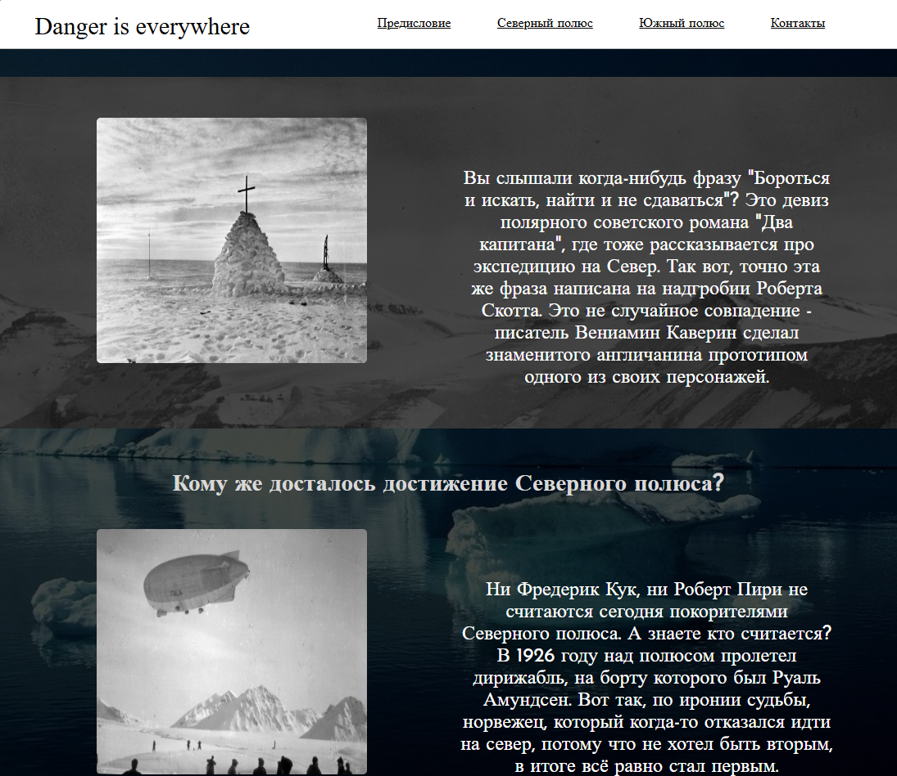

## 🧭 "Battle for the North Pole" — a one-page historical and documentary website
An interactive website dedicated to the study of the dispute over the primacy in reaching the North Pole. It is designed as an atmospheric narrative with visual and text blocks that immerse the user in the controversial pages of the history of Arctic exploration.

## 📘 Concept
- 🔍 The central question: who was the first — Frederick Cook or Robert Peary?
- ✍️ The text is designed as the author's narrative with elements of a riddle: "What really happened? Why did the dispute last for decades?"
- 🛰 Modern technologies are mentioned: satellite photographs and drifting stations, as a way of final analysis.

## 🖼 Visual elements
- Historical photographs of two polar expeditions
- Highlighted quotes with emotional delivery
- The header and subheadings are designed in an icy style - creating a feeling of arctic cold and intrigue

## Screenshots

